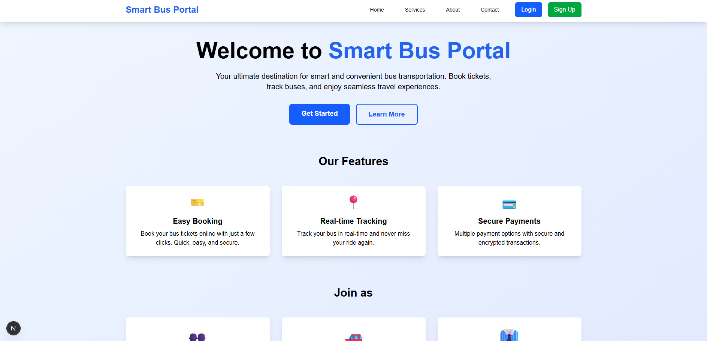
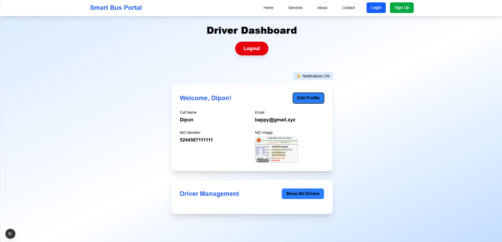
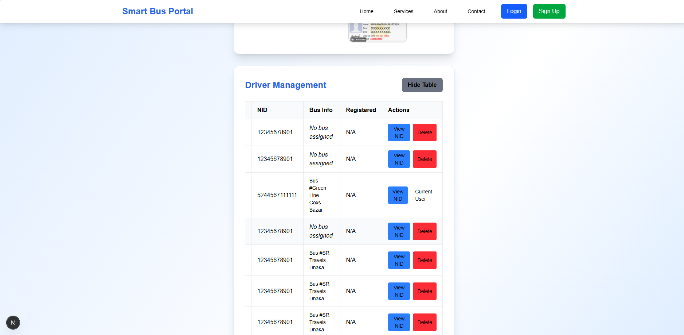
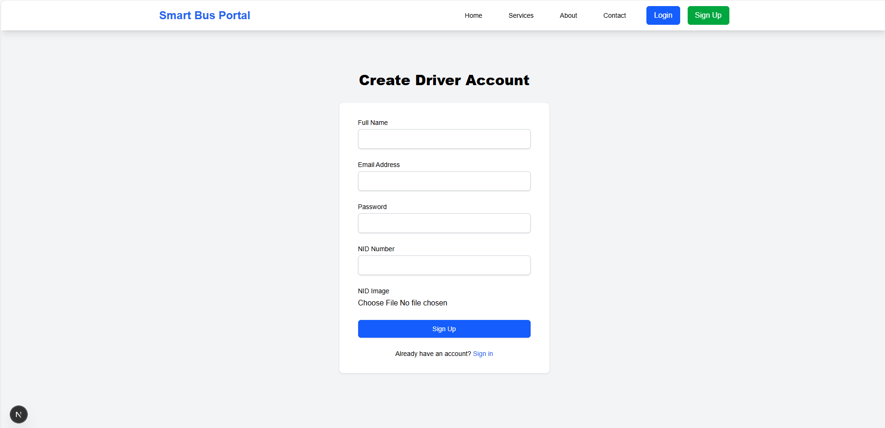
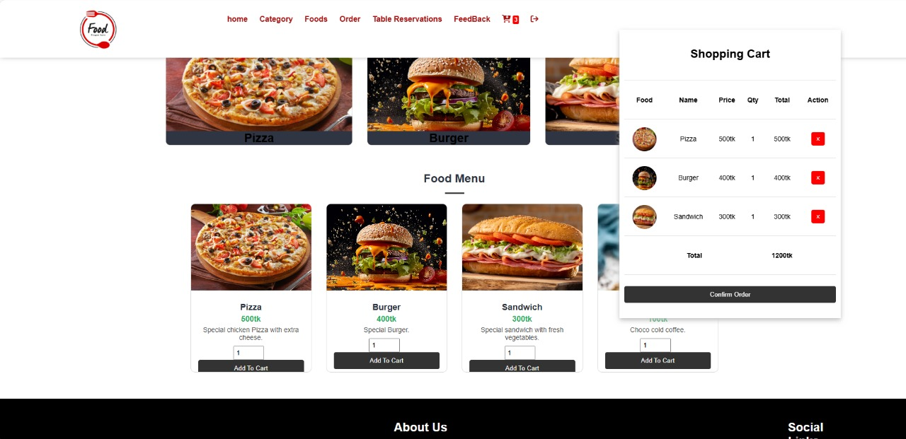

# 🚌 Smart Bus Portal - Full Stack Application

A modern, full-stack web application for smart bus transportation management. This monorepo contains both the frontend (Next.js) and backend (NestJS) implementations, providing a complete solution for bus booking, driver management, and real-time notifications.

## 📁 Project Structure

```
SmartBus_Portal/
├── SmartBus_Portal_Backend-Nest.js-/    # Backend API (NestJS)
│   └── smart_bus_portal/
│       ├── src/
│       │   ├── auth/          # JWT authentication
│       │   ├── driver/        # Driver management module
│       │   ├── bus/           # Bus management module
│       │   └── common/        # Shared services (Pusher)
│       ├── uploads/           # File storage (NID images)
│       └── test/              # E2E tests
│
└── SmartBusPortal_Frontend_Next.js/     # Frontend UI (Next.js)
    └── smart_bus_portal/
        └── app/
            ├── driver/        # Driver pages (login, signup, dashboard)
            ├── components/    # Reusable UI components
            ├── about/         # About page
            ├── services/      # Services page
            └── contact/       # Contact page
```

## 🌟 Features

### 🎯 Core Functionality
- **Smart Bus Booking System**: Easy ticket booking and reservation management
- **Driver Management**: Complete CRUD operations for driver profiles
- **Bus Management**: Track and manage bus fleet
- **Real-time Notifications**: Live updates using Pusher for driver status changes
- **Secure Authentication**: JWT-based authentication with Passport.js
- **File Upload**: NID image upload for driver verification
- **Responsive Design**: Mobile-first approach with Tailwind CSS

### 👥 User Roles
- **Passengers**: Book tickets, track buses, manage reservations
- **Drivers**: Access dashboard, manage routes, receive real-time updates
- **Admin**: System management and oversight

## 🛠️ Tech Stack

### Frontend (Next.js)
| Technology | Version | Purpose |
|------------|---------|---------|
| Next.js | 15.5.2 | React framework with App Router |
| React | 19.1.0 | UI library |
| TypeScript | 5.x | Type safety |
| Tailwind CSS | 4.x | Styling framework |
| Axios | 1.11.0 | HTTP client |
| React Hook Form | 7.62.0 | Form handling |
| Pusher JS | 8.4.0 | Real-time communication |
| Multer | 2.0.2 | File upload handling |

### Backend (NestJS)
| Technology | Version | Purpose |
|------------|---------|---------|
| NestJS | 11.0.1 | Node.js framework |
| TypeORM | 0.3.25 | ORM for database |
| PostgreSQL | - | Database |
| Passport JWT | 4.0.1 | JWT authentication |
| Bcrypt | 6.0.0 | Password hashing |
| Multer | 2.0.2 | File upload |
| Class Validator | 0.14.2 | DTO validation |
| Jest | - | Testing framework |

Screenshorts:
    

## 📋 Prerequisites

Before you begin, ensure you have:
- **Node.js** v18.0 or higher
- **npm**, **yarn**, **pnpm**, or **bun**
- **PostgreSQL** database
- **Git**
- **Pusher account** (for real-time features)

## 🚀 Getting Started

### 1️⃣ Clone the Repository
```powershell
git clone <repository-url>
cd SmartBus_Portal_Backend-Nest.js-
```

### 2️⃣ Backend Setup (NestJS)

#### Install Dependencies
```powershell
cd SmartBus_Portal_Backend-Nest.js-\smart_bus_portal
npm install
```

#### Configure Environment Variables
Create a `.env` file in the backend directory:
```env
# Database Configuration
DB_HOST=localhost
DB_PORT=5432
DB_USERNAME=your_db_username
DB_PASSWORD=your_db_password
DB_NAME=smart_bus_portal

# JWT Configuration
JWT_SECRET=your_super_secret_jwt_key
JWT_EXPIRATION=24h

# Pusher Configuration (Optional)
PUSHER_APP_ID=your_pusher_app_id
PUSHER_KEY=your_pusher_key
PUSHER_SECRET=your_pusher_secret
PUSHER_CLUSTER=your_pusher_cluster

# Server Configuration
PORT=3000
```

#### Run Database Migrations
```powershell
npm run typeorm migration:run
```

#### Start Backend Server
```powershell
# Development mode with hot reload
npm run start:dev

# Production mode
npm run build
npm run start:prod

# Debug mode
npm run start:debug
```

Backend will be available at: `http://localhost:3000`

### 3️⃣ Frontend Setup (Next.js)

#### Install Dependencies
```powershell
cd ..\SmartBusPortal_Frontend_Next.js\smart_bus_portal
npm install
```

#### Configure Environment Variables
Create a `.env.local` file in the frontend directory:
```env
# Backend API URL
NEXT_PUBLIC_API_URL=http://localhost:3000

# Pusher Configuration
NEXT_PUBLIC_PUSHER_KEY=your_pusher_key
NEXT_PUBLIC_PUSHER_CLUSTER=your_pusher_cluster
```

#### Start Frontend Server
```powershell
# Development mode with Turbopack
npm run dev

# Production build
npm run build
npm run start
```

Frontend will be available at: `http://localhost:3001` (or next available port)

## 🎨 Application Features

### Driver Management
- **Registration**: Drivers can register with personal details and NID verification
- **Authentication**: Secure login with JWT tokens
- **Profile Management**: Update driver information and credentials
- **Dashboard**: Personal driver dashboard with assigned buses
- **File Upload**: NID image upload for verification (supports JPG, JPEG, PNG up to 2MB)

### Bus Management
- **CRUD Operations**: Create, read, update, and delete bus information
- **Driver Assignment**: Link buses to specific drivers
- **Route Management**: Define and manage bus routes
- **Capacity Tracking**: Monitor bus capacity and availability

### Real-time Features
- **Live Notifications**: Instant updates for driver status changes
- **Pusher Integration**: WebSocket-based real-time communication
- **Status Updates**: Track driver and bus status in real-time

## 📖 API Documentation

Detailed API documentation is available in `API_DOCUMENTATION.md`, which includes:

### Driver Endpoints
- `POST /driver/register` - Register new driver
- `POST /driver/login` - Driver authentication
- `GET /driver` - List all drivers (protected)
- `GET /driver/:id` - Get driver by ID (protected)
- `PATCH /driver/:id` - Update driver (protected)
- `DELETE /driver/:id` - Delete driver (protected)
- `GET /driver/nid/:name` - Get NID image

### Bus Endpoints
- `POST /bus` - Create new bus (protected)
- `GET /bus` - List all buses (protected)
- `GET /bus/:id` - Get bus by ID (protected)
- `PATCH /bus/:id` - Update bus (protected)
- `DELETE /bus/:id` - Delete bus (protected)

### Authentication
Protected routes require JWT token in header:
```
Authorization: Bearer your_jwt_token
```

## 🧪 Testing

### Backend Tests
```powershell
cd SmartBus_Portal_Backend-Nest.js-\smart_bus_portal

# Unit tests
npm run test

# E2E tests
npm run test:e2e

# Test coverage
npm run test:cov

# Watch mode
npm run test:watch
```

### Frontend Tests
```powershell
cd SmartBusPortal_Frontend_Next.js\smart_bus_portal

# Run tests (if configured)
npm run test
```

## 📂 File Upload Configuration

- **Storage Location**: `./uploads/nid/`
- **Supported Formats**: JPG, JPEG, PNG
- **Maximum Size**: 2MB
- **Validation**: Server-side validation with Multer

## 🔒 Security Features

- **Password Hashing**: Bcrypt with salt rounds
- **JWT Authentication**: Secure token-based authentication
- **Input Validation**: Class-validator for DTO validation
- **File Upload Validation**: Type and size restrictions
- **CORS Configuration**: Configurable CORS policies
- **Environment Variables**: Sensitive data stored in .env files

## 🔧 Development Scripts

### Backend
```powershell
npm run start           # Start server
npm run start:dev       # Development mode with watch
npm run start:debug     # Debug mode
npm run build           # Build for production
npm run format          # Format code with Prettier
npm run lint            # Lint code with ESLint
```

### Frontend
```powershell
npm run dev             # Development mode with Turbopack
npm run build           # Build for production
npm run start           # Start production server
```

## 🌐 Deployment

### Backend Deployment
1. Set environment variables in production
2. Build the application: `npm run build`
3. Start with: `npm run start:prod`
4. Ensure PostgreSQL is accessible
5. Configure proper CORS settings

### Frontend Deployment
1. Set environment variables (NEXT_PUBLIC_*)
2. Build: `npm run build`
3. Deploy to Vercel, Netlify, or custom server
4. Ensure API URL is correctly configured

## 🐛 Troubleshooting

### Common Issues

**Backend won't start**
- Check database connection settings in `.env`
- Ensure PostgreSQL is running
- Verify port 3000 is available

**File uploads fail**
- Check uploads directory exists and has write permissions
- Verify file size is under 2MB
- Ensure file format is JPG, JPEG, or PNG

**Authentication errors**
- Verify JWT_SECRET is set in `.env`
- Check token expiration settings
- Ensure Authorization header is correctly formatted

**Frontend can't connect to backend**
- Verify NEXT_PUBLIC_API_URL in `.env.local`
- Check CORS settings in backend
- Ensure backend is running

## 📝 Environment Variables Reference

### Backend (.env)
```env
DB_HOST=              # Database host
DB_PORT=              # Database port
DB_USERNAME=          # Database username
DB_PASSWORD=          # Database password
DB_NAME=              # Database name
JWT_SECRET=           # JWT secret key
JWT_EXPIRATION=       # Token expiration time
PUSHER_APP_ID=        # Pusher app ID
PUSHER_KEY=           # Pusher key
PUSHER_SECRET=        # Pusher secret
PUSHER_CLUSTER=       # Pusher cluster
PORT=                 # Server port
```

### Frontend (.env.local)
```env
NEXT_PUBLIC_API_URL=          # Backend API URL
NEXT_PUBLIC_PUSHER_KEY=       # Pusher key (public)
NEXT_PUBLIC_PUSHER_CLUSTER=   # Pusher cluster
```

## 🤝 Contributing

1. Fork the repository
2. Create a feature branch: `git checkout -b feature/AmazingFeature`
3. Commit your changes: `git commit -m 'Add some AmazingFeature'`
4. Push to the branch: `git push origin feature/AmazingFeature`
5. Open a Pull Request

## 📄 License

This project is licensed under UNLICENSED - see the backend package.json for details.

## 👨‍💻 Author

Smart Bus Portal Development Team

## 📞 Support

## 🔄 Version History

- **v0.1.0** (Frontend) - Initial release with driver management
- **v0.0.1** (Backend) - Initial release with authentication and CRUD operations

## 🎯 Future Enhancements

- [ ] Passenger booking system
- [ ] Payment gateway integration
- [ ] Real-time bus tracking with GPS
- [ ] Route optimization algorithms
- [ ] Mobile application (React Native)
- [ ] Admin dashboard
- [ ] Email notifications
- [ ] SMS integration
- [ ] Analytics and reporting
- [ ] Multi-language support

## 📚 Additional Resources

- [NestJS Documentation](https://docs.nestjs.com/)
- [Next.js Documentation](https://nextjs.org/docs)
- [TypeORM Documentation](https://typeorm.io/)
- [Pusher Documentation](https://pusher.com/docs)
- [Tailwind CSS Documentation](https://tailwindcss.com/docs)

---

**Built with ❤️ using NestJS and Next.js**
